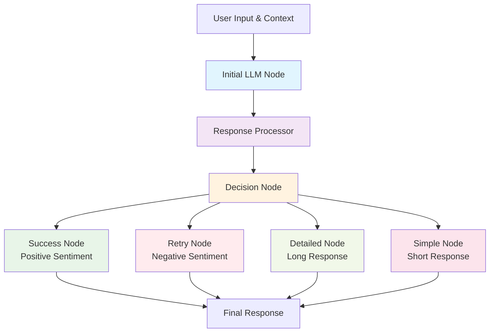

# Simple Agent LLM Flow Example

A comprehensive demonstration of integrating LLM API calls within AgentFlow's async workflow system, showcasing how AI responses can drive intelligent routing and decision-making in agent workflows.

## Overview

This example demonstrates the integration of Large Language Model (LLM) capabilities with AgentFlow's async execution framework. It shows how to:

- Create LLM-powered agent nodes using the moonshot demo pattern
- Process and analyze AI responses programmatically
- Make intelligent routing decisions based on response characteristics
- Manage complex conversational flows with shared state
- Combine deterministic logic with AI-driven decision making

## Architecture

### Flow Structure

The example implements a sophisticated 5-node workflow:

```
[User Input] → [Initial LLM] → [Response Processor] → [Decision Node] → [Specialized Nodes]
```

### Node Types

1. **LLMAgentNode**: Custom AsyncNode that makes LLM API calls
2. **ResponseProcessorNode**: Analyzes LLM responses for sentiment and complexity
3. **DecisionNode**: Routes flow based on response analysis
4. **Specialized Nodes**: Different LLM strategies for various scenarios

## Workflow Diagram



## Key Components

### 1. LLMAgentNode

The core LLM integration component that:

- Uses dynamic prompt templates with placeholder substitution
- Follows the moonshot demo pattern: `AgentFlow::model("moonshot-v1-8k").prompt().execute()`
- Provides comprehensive error handling and logging
- Stores responses in shared state for downstream processing

**Key Features:**

```rust
// Dynamic prompt building
fn build_prompt(&self, shared_state: &SharedState) -> String {
    let mut prompt = self.prompt_template.clone();
    if let Some(Value::String(user_input)) = shared_state.get("user_input") {
        prompt = prompt.replace("{user_input}", &user_input);
    }
    // ... more placeholder replacements
    prompt
}
```

### 2. ResponseProcessorNode

Analyzes LLM responses with:

- **Word Count Analysis**: Measures response complexity
- **Sentiment Detection**: Basic positive/negative/neutral classification
- **Structured Output**: Creates analysis metadata for decision making

**Analysis Logic:**

```rust
let sentiment = if llm_response.contains("good") ||
                   llm_response.contains("great") ||
                   llm_response.contains("excellent") {
    "positive"
} else if llm_response.contains("bad") ||
          llm_response.contains("terrible") ||
          llm_response.contains("awful") {
    "negative"
} else {
    "neutral"
};
```

### 3. DecisionNode

Implements intelligent routing based on:

- **Sentiment-Based Routing**:
  - Positive → Success Node
  - Negative → Retry Node
  - Neutral → Length-based routing
- **Complexity-Based Routing**:
  - Long responses (>10 words) → Detailed Node
  - Short responses (≤10 words) → Simple Node

### 4. Specialized Terminal Nodes

Different LLM strategies for various scenarios:

- **Success Node**: Celebratory follow-up for positive responses
- **Retry Node**: Encouraging retry for negative responses
- **Detailed Node**: Summarization for complex responses
- **Simple Node**: Expansion for brief responses

## Configuration

### Prerequisites

1. **LLM Configuration**: Ensure proper `models.yml` configuration
2. **API Keys**: Set up moonshot API credentials in environment or `.env`
3. **Network Access**: Connectivity to moonshot LLM provider

### Environment Setup

```bash
# Set API key (example)
export MOONSHOT_API_KEY="your-api-key-here"

# Or create .env file
echo "MOONSHOT_API_KEY=your-api-key-here" >> .env
```

### Models Configuration

Ensure `models.yml` includes moonshot model configuration:

```yaml
models:
  moonshot-v1-8k:
    vendor: "moonshot"
    model_id: "moonshot-v1-8k"
    temperature: 0.7
    max_tokens: 1000
```

## Running the Example

### Basic Execution

```bash
cargo run --example simple_agent_llm_flow
```

### With Debug Logging

```bash
RUST_LOG=debug cargo run --example simple_agent_llm_flow
```

### Expected Output

```
🌟 Simple Agent Flow with LLM Integration Demo
This demonstrates how LLM (moonshot demo) can be invoked within an agent flow

🚀 Starting the agent flow...

🤖 [initial_llm] Preparing LLM request with prompt: You are a helpful assistant...
✅ [initial_llm] LLM configuration loaded successfully
🚀 [initial_llm] Executing LLM request to model: moonshot-v1-8k
✅ [initial_llm] LLM Response received: Deep Learning is a subset of machine learning...
💾 [initial_llm] Stored LLM response in shared state

🔍 [processor] Processing LLM response: Deep Learning is a subset of machine learning...
📊 [processor] Analysis complete: 45 words, neutral sentiment
📋 [processor] Analysis stored in shared state

🤔 [decision] Making decision based on sentiment: neutral, words: 45
✅ [decision] Decision made: route to detailed_node

🤖 [detailed] Preparing LLM request with prompt: The previous response was detailed...
✅ [detailed] LLM Response received: Deep Learning uses neural networks to learn patterns.
💾 [detailed] Stored LLM response in shared state

🎉 Flow completed successfully!
Final result: detailed_node

📋 Flow execution summary:
✅ Initial LLM node executed
   Response: Deep Learning is a subset of machine learning that uses artificial neural networks...
✅ Response processor executed
   Analysis: {"word_count":45,"sentiment":"neutral","original_response":"Deep Learning is..."}
✅ Decision node executed
   Decision: "detailed_node"
✅ Final node 'detailed' executed
   Final response: Deep Learning uses neural networks to learn patterns.

🏁 Demo completed!
```

## Customization

### 1. Modify Prompts

Edit prompt templates in the node creation:

```rust
let llm_node = LLMAgentNode::new(
    "initial_llm",
    "You are an expert in {topic}. Please explain: {user_input}",
    "moonshot-v1-8k"
);
```

### 2. Add New Analysis Criteria

Extend the ResponseProcessorNode:

```rust
// Add topic classification
let topic = if llm_response.contains("technology") {
    "tech"
} else if llm_response.contains("science") {
    "science"
} else {
    "general"
};
```

### 3. Implement New Routing Logic

Modify the DecisionNode routing:

```rust
let decision = match (sentiment, word_count, topic) {
    ("positive", _, "tech") => "tech_success_node",
    ("negative", _, _) => "retry_node",
    (_, count, _) if count > 50 => "summary_node",
    _ => "default_node"
};
```

### 4. Add More LLM Models

Use different models for different nodes:

```rust
let analysis_node = LLMAgentNode::new(
    "analyzer",
    "Analyze the sentiment of: {response}",
    "gpt-4"  // Different model
);
```

## Advanced Usage

### 1. Parallel Processing

Create parallel analysis nodes:

```rust
let sentiment_node = LLMAgentNode::new("sentiment", "...", "model1");
let topic_node = LLMAgentNode::new("topic", "...", "model2");

let parallel_flow = AsyncFlow::new_parallel(vec![
    Box::new(sentiment_node),
    Box::new(topic_node)
]);
```

### 2. Error Recovery

Implement retry logic in nodes:

```rust
// In exec_async
let mut attempts = 0;
loop {
    match LLMAgentFlow::model(model).prompt(prompt).execute().await {
        Ok(response) => return Ok(response),
        Err(e) if attempts < 3 => {
            attempts += 1;
            continue;
        },
        Err(e) => return Err(e)
    }
}
```

### 3. Streaming Responses

Use streaming for real-time processing:

```rust
let stream = LLMAgentFlow::model(model)
    .prompt(prompt)
    .execute_streaming().await?;

// Process stream chunks
while let Some(chunk) = stream.next().await {
    // Handle streaming response
}
```

## Performance Considerations

### 1. Concurrent LLM Calls

- Use `AsyncFlow::new_parallel()` for independent LLM operations
- Implement rate limiting for API compliance
- Consider caching responses for repeated queries

### 2. Memory Management

- Clear large responses from shared state when no longer needed
- Use streaming for long responses
- Implement response size limits

### 3. Error Handling

- Implement exponential backoff for API failures
- Use circuit breaker patterns for unreliable endpoints
- Provide fallback responses for critical paths

## Troubleshooting

### Common Issues

1. **API Key Not Found**

   ```
   Error: LLM initialization failed: API key not configured
   ```

   **Solution**: Set environment variable or .env file

2. **Model Not Available**

   ```
   Error: Model 'moonshot-v1-8k' not found in configuration
   ```

   **Solution**: Update models.yml with correct model configuration

3. **Network Timeouts**
   ```
   Error: Request timeout
   ```
   **Solution**: Increase timeout or check network connectivity

### Debug Tips

1. **Enable Detailed Logging**:

   ```bash
   RUST_LOG=agentflow_llm=debug cargo run --example simple_agent_llm_flow
   ```

2. **Inspect Shared State**:

   ```rust
   println!("Shared state: {:?}", shared.debug_dump());
   ```

3. **Add Timing Information**:
   ```rust
   let start = std::time::Instant::now();
   // ... LLM call
   println!("LLM call took: {:?}", start.elapsed());
   ```

## Related Examples

- `moonshot_demo.rs` - Basic LLM integration pattern
- `workflow.rs` - Sequential multi-stage workflows
- `batch_processing.rs` - Parallel processing patterns
- `chat.rs` - Interactive conversation flows

## Next Steps

1. **Extend Analysis**: Add more sophisticated NLP analysis
2. **Multi-Model**: Use different LLMs for different tasks
3. **Persistence**: Store conversation history and context
4. **Integration**: Connect with external APIs and databases
5. **Monitoring**: Add comprehensive metrics and alerting

This example serves as a foundation for building sophisticated AI-powered agent workflows that combine the reliability of structured flows with the flexibility of LLM-driven decision making.
